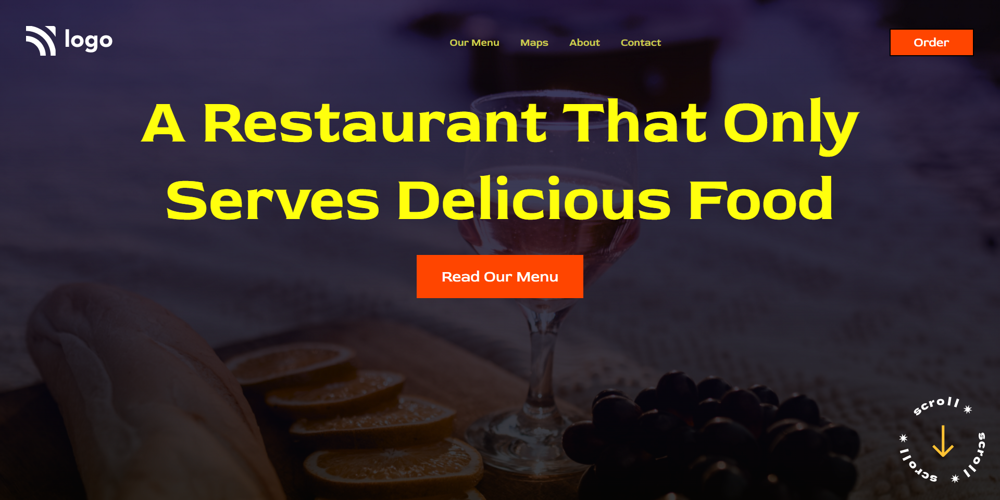

# HTML  and CSS 

# Project 2 - Restaurant Landing Page 

By Maulik Vadodariya

## [Link to the live Project](https://restaurant-bar-page.netlify.app/assets/readme-images/ScreenShot-20221022190655.png)

## What I learned from this Project?

- I have done this project using HTML and CSS only.
- In this project I learned about `background` and CSS Gradients.
- In this project I learned a lot about position `button` and order-unorder list elements.
- In this project I learned about google fonts.

## I spent 2.5 to 3 hours in making this project
